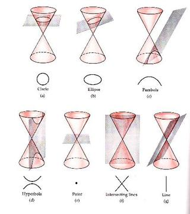

```{r setup2, include=FALSE}
knitr::opts_chunk$set(echo = TRUE, message=FALSE, warning=FALSE,
                      comment="", digits = 3, tidy = FALSE, prompt = FALSE, fig.align = 'center')

library(reticulate)
```

수학의 역사와 한국인이 선정했다는 $\pi, \infty, x, 0, i$ 숫자에 대해 살펴본다.

수학은 양, 구조, 공간, 변화 등 개념을 다루는 학문이다.[^1] 사회가 복잡해지고 더 많은 것을 간편하게 해결하고자 하는 인간의 욕구는 부의 저장, 상업거래를 넘어 과학과 기술분야에 혁신적인 수학을 개발했으며, 0과 1 두가지 숫자로 이제는 그 어떤 인간도 경험해보지 못한 미지의 세계에 대한 여정을 계속하고 있다. 결국, 수학의 발전은 사회의 요구에 따라 발전을 함께 했고, 앞으로도 그럴 것이다.

[^1]: [수학(위키백과)](https://ko.wikipedia.org/wiki/수학)


# 수학의 역사 [^2] [^3] {#history-of-math}

[^2]: [History of Mathematics in 50 Minutes](https://www.youtube.com/watch?v=YsEcpS-hyXw)

[^3]: [History of Mathematics by Keith Devlin at Stanford](https://www.youtube.com/watch?v=pk49iM9OT_0&list=PLUSC1HoMnGTi7Q4T6FCYwifor9D8d03y3)

1.  **수** 의 발전은 그 당시 가장 복잡한 사회인 수메르 문명의 복잡한 문제 중의 하나인 부의 저장과 관련이 있다.
2.  인도에서 **0** 이 발견되고 이것이 아라비아로 전달되어 상업에 많이 사용되고 있었으나, 아라비아는 그 당시 유산과 관련된 엄청나게 복잡한 문제가 있었고, 이를 해결하기 위한 기법으로 **대수(Algebra)** 를 발명하여 사회문제를 효과적으로 해결했다.
3.  이탈리아는 그 당시 가장 발전한 아라비아와 빈번하게 무역거래를 했으며, 오늘날 **피보나치** 로 알려진 가문에 속한 사람이 북아프리카에서 유년시절 아랍상인과 상업거래를 하면서 배운 놀라운 수학을 한편의 책으로 정리하여 힌두-아라빅(Hindu-Arabic) 수학을 아탈리아에 소개하면서, 일약 이탈리아는 금융의 중심지가 되었고, 이것이 밑걸음이 되어서 복식부기 등 혁신적인 금융기법이 많이 발전했다.
4.  르네상스 이후로 신 중심 가치관에서 벗어나 인간 중심으로 세상을 이해하고자 하는 노력이 많이 일어 났고, 또한, 기존의 정적인 세상이 아닌 동적인 사물이나 세상을 수학적으로 표현하고자 하는 움직임이 있었고, 과학과 기술에 대한 믿음도 함께 했다. 움직임에 대한 수학이 **미적분학(Calculus)** 으로 영국의 뉴튼 혹은 독일의 라이프니치가 먼저 했는지 중요하지만, 두 사람이 비슷한 생각을 거의 같은 시기에 했던 것만은 분명해 보이고, 라이프니치의 수학적 표현이 더 좋기 때문에 현재 미적분 표기법은 라이프니치를 따른다.
5.  과거와 현재, 그리고 운동에 대한 것을 수학으로 다룰 수 있기 때문에 이제 남은 것은 미래에 대한 것이다. 누구나 궁금한 미래를 알기 위해서 **확률과 통계** 가 차례로 발전하게 된다.
6.  인간이 가장 약한 것 중의 하나인 계산을 **0** 과 **1** 을 통해 기계가 대신할 뿐만 아니라, 더 나아가 새논은 **0** 과 **1** 을 통해서 숫자와 문자는 물론이고, 음성, 사진, 동영상을 전송하는 것이 가능하다는 것을 보였다.

## '넘버스'(5부작) {#numbers-ebs}

EBS에서 세상을 바꾼 숫자 5개를 정해서 다큐멘터리를 만들었다. [**세상을 바꾼 5개의 수-넘버스(5부작)**](http://home.ebs.co.kr/docuprime/newReleaseView/297?c.page=1)로 $\pi, \infty, x, 0, i$ 를 한국어로 나름 이해하기 쉽게 만들었다.

1.  [넘버스 - 1부 하늘의 수, $\pi$](http://www.ebs.co.kr/tv/show?prodId=348&lectId=10400921)
2.  [넘버스 - 2부 천국의 사다리, $\infty$](http://www.ebs.co.kr/tv/show?prodId=348&lectId=10401181)
3.  [넘버스 - 3부 자유의 수, $x$](http://www.ebs.co.kr/tv/show?prodId=348&lectId=10402446)
4.  [넘버스 - 4부 신의 손짓, $0$](http://www.ebs.co.kr/tv/show?prodId=348&lectId=10404094)
5.  [넘버스 - 5부 천공의 수, $i$](http://www.ebs.co.kr/tv/show?prodId=348&lectId=10404366)

# 초등 수학 [^ahn] {#all-about-math}

[^ahn]: 안병곤(2012), "초등수학교육", 방과후 활동 심화과정, [링크](http://contents.kocw.or.kr/document/lec/2012/GwangJuEdu/AhnByungGon/1.pdf)

수학을 학습하는 이유는 다른 과목과 밀접하고 수학(修學) 능력배양에 도움이 되고 끈기와 집중력 향상에 도움을 주는 뿐만 아니라 모든 과학의 공통언어로 정보화 사회 지탱하는 기초 학문이다.

수학은 농경사회에서 문화는 강 유역을 중심으로 발달했는 데 이유는 고대국가가 형성에 따라, 농업과 목축에서 농토관리나 생산물 분배와 조정과 일상생활에서 발생하는 불편함의 해소 과정에서 발생되었다. 산술, 대수학, 기하학, 해석학 등이 수학의 세부 분야로 각기 필요에 의해 만들어져 발달되었다.

-   기하학: 토지 경계선의 측정
-   대수학: 물물교환이나 조세 부과에서 수와 계산이 필요
-   삼각법: 강과 바다를 건너는 항해술

## 탈레스 {#thales}

그리스의 Miletus에서 태어나 젊은 시절에 상인으로 많은 돈을 벌어서 연구와 여행으로 여생 보낸 사람으로 그리스 철학의 아버지이자 기하학 창시자로 알려져 있다. 그리스 수학의 특징인 명확한 논증적 증명을 시작했다. 탈레스가 증명한 증명은 다음과 같다.

-   두 직선이 만날 때 그 맞꼭지각의 크기는 서로 같다.
-   이등변삼각형의 두 밑각은 서로 같다.
-   두 삼각형에서 두 변의 길이와 그 끼인각이 같으면 서로 합동이다.
-   두 삼각형에서 그 두 내각과 한 변의 길이가 같으면 서로 합동이다.
-   삼각형의 내각의 합은 180도 이다.
-   한 원에서 지름에 대한 원주각의 크기는 직각이다.
-   두 개의 삼각형에서 대응하는 변이 모두 평행이면, 두 삼각형은 서로 닮음이다.

## 피타고라스 {#pythagoras}

에게 海의 Samos 섬에서 태어났으며 피타고라스 정리는 유클리트의 기하학원본의 제 1권에 증명과 함께 실려 있다.

-   수의 성질 연구: 예를 들어, 신이 세상을 6(6=1+2+3 )일 동안에 창조하여 6은 완전수, 28은 달의 주기로 신의 창조에 대한 완전성 상징

-   형상수(Figurate number) [^4]: 기하학적 배열에서 점의 개수에 의한 기하학과 산술과 밀접한 관계 (삼각수, 사각수, 오각수 등)

    -   **다각수(polygonal number)** [^5]는 삼각수와 정사각수를 임의의 정다각형에까지 일반화하여 얻는 평면 도형수이다. 기하학적으로, 다각수는 정다각형에 배열된 공의 수를 나타낸다. 주어진 다각수 바로 다음에 오는 다각수를 얻으려면 다각형의 이웃하는 두 변의 길이를 늘려 원래와 닮은 새로운 다각형으로 확장하면 된다. 이 경우 늘리려는 두 변에 각각 한 개의 공이 추가되며, 새로운 다각형의 남은 변을 만들기 위한 공들 역시 추가된다. 이렇게 추가되는 부분을 다각수의 **그노몬(gnomon)**이라고 부른다. 대수학적으로, 다각수는 1에서 시작하는 자연수 공차의 등차 수열의 부분합을 나타내며, 그노몬은 이 등차 수열의 각 항에 대응한다.

[^4]: [Polygonal and Figurate Numbers or Numbers as Shapes](http://www.maths.surrey.ac.uk/hosted-sites/R.Knott/Figurate/figurate.html)

[^5]: [위키백과, "다각수"](https://ko.wikipedia.org/wiki/다각수)

{width="570"}

-   피타고라스 정리: "직각삼각형의 빗변을 한 변으로 하는 정사각형의 넓이는 다른 두 변 위에 세워진 정사각형의 넓이의 합과 같다.",

    -   목수의 정리: 피타고라스 정리는 넓이에 관한 것처럼 보이나 직각을 이루는 각 변의 길 이의 관계 또는 거꾸로 직각을 만들기 위한 3변의 길이에 관한 문제이기도 하다.

-   정다면체(5개): 정4면체, 정6면체, 정8면체, 정12면체, 정20면체

## 플라톤 {#plato}

소크라테스의 제자로 아테네의 서쪽 교외인 아카데모스의 숲에 학교를 세워 제자 양성했는데기하학과 산술을 주로 가르쳤으며 교문에 "기하학을 모르는 자는 이 문안에 들어오지 말라."라고 써 있었음. 플라톤 철학의 정수 이데아(Idea)설로 바라론 수학은 "수학에서 정확한 자로 직선이나 컴퍼스로 원을 그리면 단지 그렇게 보일 뿐 실제로 직선이나 원은 없고 인간의 이성(즉 이데아의 세계)에서 존재."라고 함.

-   완전한 삼각형이나 원은 관념의 세계에서만 이루어진 관념론 주장.
-   플라톤은 수학의 대상과 구조는 인간과 무관하게 객관적으로 존재하며 수학을 한다는 것은 이미 존재하는 그 관계를 발견하는 과정
-   수학의 대상인 수나 도형은 불변인 이데아로, 기하학이 알려는 것은 영원한 존재이며 어느 시기에 생성했다가 소멸하는 것이 아니라 주장

## 유클리드 {#euclid}

플라톤의 사상을 가장 잘 나타낸 수학자로 당시까지 기하학을 체계적으로 정리한 13권의 책(Elements)을 저술함. 책에는 465개의 명제가 수록됨.

-   유클리트의 5개 공준

    -   한 점에서 다른 한 점으로 직선을 그을 수 있다.
    -   직선은 얼마든지 연장할 수 있다.
    -   주어진 점을 중심으로 주어진 반지름을 갖는 원을 그릴 수 있다.
    -   직각은 서로 같다.
    -   한 직선이 다른 두 개의 직선과 만나서 두 내각의 합이 180°보다 작을 때는 그 두 직선을 연장하면 내각의 합이 180˚보다 작은 쪽에서 만난다.

## 아르키메데스 {#Archimedes}

시칠리아섬의 시라쿠사에서 철학자의 아들로 태어나 이집트의 알랙산드리아에서 오랫동안 유학생활을 함.

-   근대적 의미에서 과학의 창시자로 원주율 $\pi$, 원의 넓이, 구의 표면적과 구의 부피를 구하여 17세기의 미적분학의 기초 마련.

## 아폴로니우스 {#Appolonius}

평면이 원뿔과 만나서 만들어지는 여러 가지 곡선을 연구하였다.

-   원뿔의 한 요소와 수직인 평면으로 자르면 원뿔과 평면이 이루는 각에 따라 원, 타원, 포물선, 쌍곡선이 만들어진다. 아폴로니우스 이전의 그리스 수학자들도 원뿔 곡선을 원뿔의 꼭지각이 90도보다 작은지, 같은지, 큰지에 따라 세 가지 형태로 구분하여 타원, 포물선, 쌍곡선을 만들어냈다.
-   평면이 원뿔의 밑면과 평행하면 원, 평면이 원뿔의 밑면과 비스듬하게 만나면 타원, 모선과 평행하게 만나면 포물선, 그리고 이중 원뿔에서 평면이 밑면과 수직으로 만나면 쌍곡선.
-   타원(ellipse), 포물선(parabola), 쌍곡선(hyperbola)이름도 아폴로니우스가 만든 것으로, 초기 피타고라스 학파가 넓이에 대하여 사용한 용어로부터 따온 것.

{width="437"}

- 아폴로니우스의 정리: 중선정리
- 아폴로니우스의 원

## 현대수학으로 넘어오며 {#beyond-classic-math}

-   바라마굽타(598 \~ 660)는 1차 부정방정식의 일반해와 이차방정식의 근의 공식을 구한 최초 사람
-   오늘날 아라비아 숫자는 이 시기 이탈리아의 피보나치가 유럽에 소개.
-   17세기에 데카르트(1596 \~ 1650) 등은 대수의 기호화($x, y, z, \cdots$)로 오늘날 '기호적 수학'인 기하와 대수 결합
-   데카르트의 해석기하학의 탄생으로 미분법과 적분법 발견
-   무한소량이나 극한개념을 바탕으로 한 수학은 18세기 수학의 주류

데카르트의 기하학은 유클리드가 삼각형에서 시작한 것과는 달리 평면을 구성하는 최소 원소인 점에서 출발하여 이 점들을 순서쌍으로 나타내는 **좌표 기하학**을 만들었다.

-   모든 도형을 점으로 분해하여 곡선은 점이 움직이는 궤적으로 파악하여 운동과 변화가 적극적으로 활용되는 수학 시작

프랑스 수학자 데카르트와 페르마는 해석기하학을 창시하여 17세기의 수학에 결정적 공헌

-   데카르트는 대부분 자취로 시작하여 방정식 발견
-   페르마는 방정식으로 시작하여 자취 연구
