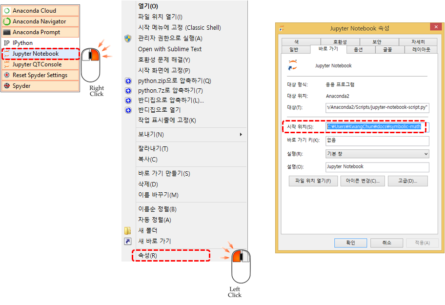

> ## 학습목표 {.objectives}
>
> * 인터넷이 연결된 컴퓨터에서 직접 심파이를 경험한다.
> * 심파이를 개인 컴퓨터에 설치한다.
> * 심파이 개발환경을 쥬피터에 맞춰 최적화한다.

### 파이썬 심파이 인터넷 개발 환경

[심파이 라이브!](http://live.sympy.org/) 환경은 인터넷이 연결된 웹브라우져에서 
바로 수학객체를 기호로 다룰 수 있는 환경을 제공한다. 파이썬 심파이를 사전에 맛볼 수 있다.

### 파이썬 심파이 설치

심파이(Sympy)를 설치하는 다양한 방법이 존재한다. 우분투 운영체제에서 파이썬을 설치하는 방법은 
먼저 `python-pip` 팩키지 설치 관리자를 설치하고 `pip install` 명령어를 통해 `sympy`를 설치한다.

~~~ {.python}
vagrant@vagrant-ubuntu-trusty-64:~$ sudo apt-get install python-pip
vagrant@vagrant-ubuntu-trusty-64:~$ sudo pip install sympy
vagrant@vagrant-ubuntu-trusty-64:~$ python
~~~

`sympy`가 정상적으로 설치가 되었는지 확인하기 위해서 파이썬 명령라인 인터페이스에 
[심파이 사전준비](http://docs.sympy.org/dev/tutorial/preliminaries.html) 예제를 실행한다.

수학문제는 $\int e^x cos(x) dx$ 적분을 계산하는 것이다.
정답은 손으로 계산하면 다음과 같은 결과가 도출되어야 한다.

$\int e^x cos(x) dx = \frac{e^x}{2} sin(x) +  \frac{e^x}{2} cos(x)$

상기 수식을 심파이 구문으로 `Integral(cos(x)*exp(x), x)` 와 같이 입력하고,
`Eq` 함수에 인자로 구문과 더불어 `.doit()` 메쏘드를 실행한다.

~~~ {.output}
Python 2.7.6 (default, Jun 22 2015, 17:58:13)
[GCC 4.8.2] on linux2
Type "help", "copyright", "credits" or "license" for more information.
>>> from sympy import *
>>> x = symbols('x')
>>> a = Integral(cos(x)*exp(x), x)
>>> a
Integral(exp(x)*cos(x), x)
>>> Eq(a, a.doit())
Eq(Integral(exp(x)*cos(x), x), exp(x)*sin(x)/2 + exp(x)*cos(x)/2)
~~~

### 쥬피터 노트북에서 심파이 

`init_printing(use_latex='mathjax')` 설정을 쥬피터 노트북을 통해 설정하게 되면 위와 같은 텍스트 출력수식이 아닌 
수학책에 나오는 수식이 표현된다.

~~~ {.python}
init_printing(use_latex='mathjax')
from sympy import *
x = symbols('x')
a = Integral(cos(x)*exp(x), x)
a
Eq(a, a.doit())
~~~

$\int e^x cos(x) dx = \frac{e^x}{2} sin(x) +  \frac{e^x}{2} cos(x)$

### 쥬피터 노트북 작업 디렉토리 설정

쥬피터 노트북을 기본 설정으로 시작할 경우 작업하고자 하는 디렉토리와 차이가 나는 경우가 있다.
윈도우에서 쥬피터 노트북 작업환경을 설정할 경우 쥬피터 노트북 실행 버튼위에 마우스를 올리고 우클릭해서
**속성** 을 선택해서 속성창에서 시작 위치를 작업 작업디렉토리로 설정한다.

리눅스나 맥의 경우는 더욱 단순한다. `ipython notebook --notebook-dir=` 명령어에 작업 디렉토리를 인자로 넣어준다.
작업디렉토리가 `C:\Users\KwangChun\docs\symbolic-math`으로 설정했는데 본인 환경에 맞춰 설정한다.

~~~ {.python}
$ ipython notebook --notebook-dir=C:\Users\KwangChun\docs\symbolic-math
~~~

### 쥬피터 노트북을 마크다운으로 변환 [^nbconvert-to-markdown]

[^nbconvert-to-markdown]: [Converting notebooks to other formats](https://ipython.org/ipython-doc/3/notebook/nbconvert.html)

아이파이썬 노트북을 마크다운으로 변환할 경우 `ipython nbconvert`가 명령어가 되며, 변환할 대상 노트북을 인자 넣고 `01-numpy.ipynb` `--to` 에 마크다운으로 명기한다.

~~~ {.python}
$ ipython nbconvert 01-numpy.ipynb --to markdown
~~~

`ipython` 대신에 `jupyter` 를 향후 사용한다. 이유는 `ipython nbconvert is deprecated and will be removed in future versions.` 조만간 사용이 정지될 것이기 때문이다.

~~~ {.python}
$ jupyter nbconvert 01-numpy.ipynb --to markdown
~~~