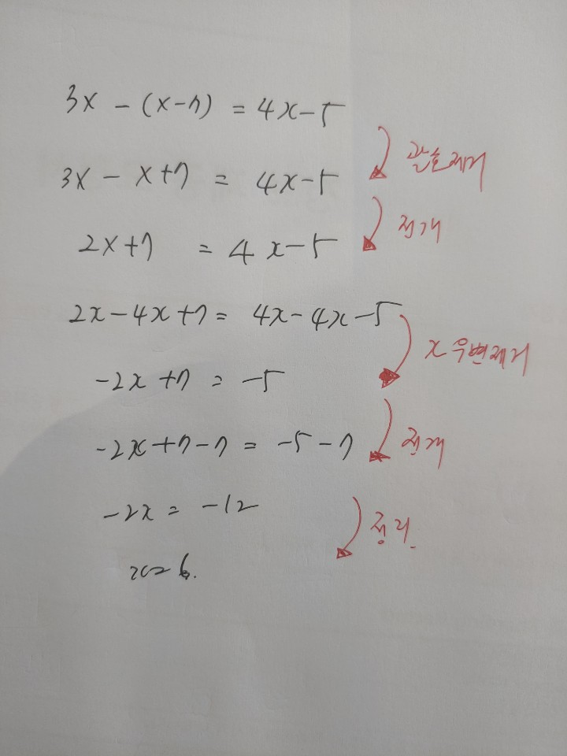
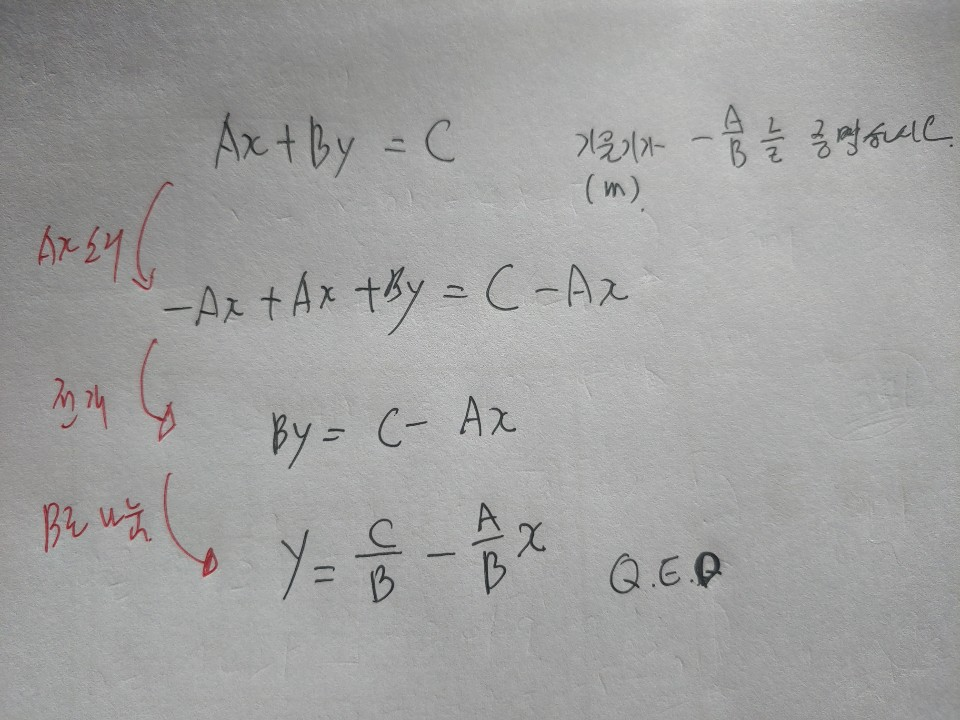

 

``` {r, include=FALSE}
knitr::opts_chunk$set(echo = TRUE, message=FALSE, warning=FALSE,
                      comment="", digits = 3, tidy = FALSE, prompt = FALSE, fig.align = 'center')
library(tidyverse)
library(extrafont)
loadfonts()
library(reticulate)
```

# The Humongous Book of Calculus Problems {-#calculus-problems}

# 1차 방정식과 부등식 {#linear-equation}

Linear Equations and Inequalities를 1차 방정식과 부등식이라고 표현합니다.

## 다음 등식에서 $x$를 구하시오.

$$3x -(x-7)=4x-5$$

{#id .class width="50%"}

우변에 있는 모든 항을 좌변으로 옮기고 나서 이를 `Eq()`함수로 방정식을 만드고 `solve()`함수로 `x`에 대한 해를 구한다.

```{python solve-equation}
from sympy import *

x = symbols('x')
linear_eq = Eq(3*x -(x-7) - 4 * x + 5)
solve(linear_eq, x)
```

## 기울기(`m`)가 $-\frac{A}{B}$를 증명 [^solving-symbolic-equation]

[^solving-symbolic-equation]: [Solving symbolic equations with SymPy](https://scaron.info/blog/solving-symbolic-equations-with-sympy.html)

$Ax + By = C$ 선형 방정식에서 기울기(`m`)가 $-\frac{A}{B}$임을 증명하시오.

{#id .class width="50%"}

```{python solve-equation-slope}
x, y = var('x y')

A, B, C = var('A B C')

slope_eq = A * x + B * y - C

solve(slope_eq, y)
```

## 두점 $(-3,-8)$, $(-6,2)$를 지나는 선형 방정식을 구하시오 

```{r ggplot-two-points}
library(tidyverse)

points_df <- tribble(
  ~x, ~y,
  -3, -8,
  -6, 2
)

points_df %>% 
  ggplot(aes(x=x, y=y)) +
    geom_point(size=2) +
    scale_y_continuous(limits = c(-10, 5))

```


