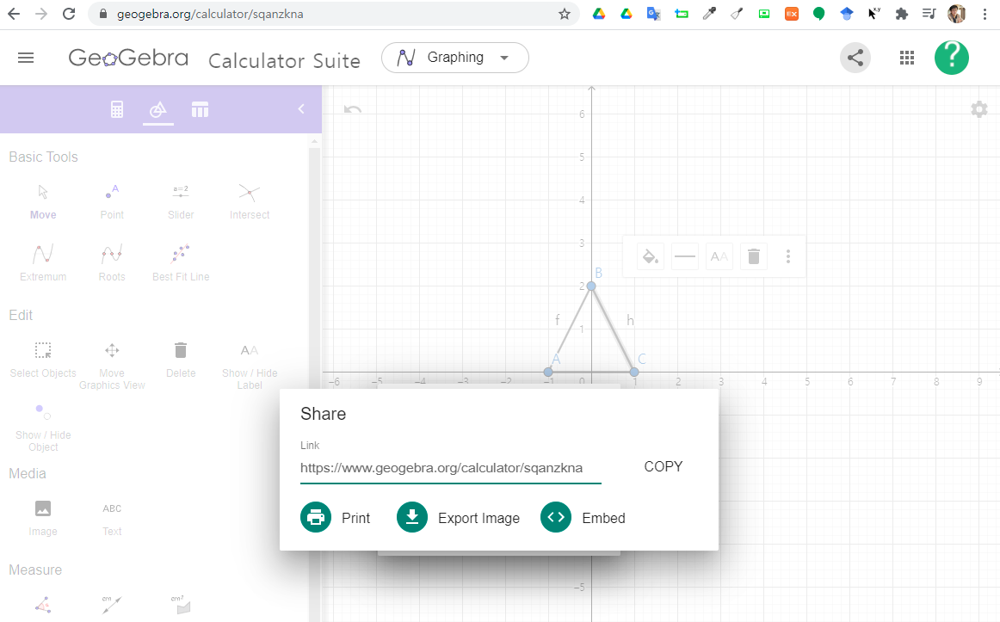

```{r setup2, include=FALSE}
knitr::opts_chunk$set(echo = TRUE, message=FALSE, warning=FALSE,
                      comment="", digits = 3, tidy = FALSE, prompt = FALSE, fig.align = 'center')

library(reticulate)
```

# GeoGebra 객체 삽입 {#embed-geogebra}

[지오지브라 (GeoGebra)](https://www.geogebra.org/) 수학 앱을 사용해서 그래프, 기하, 3차원 기하 문제를 푸는데 사용할 수 있다.

[Embedding GeoGebra Apps Made Easier!](https://www.youtube.com/watch?v=8zM-CrtJmGg) 방법을 사용해서 수월하게 수학문제를 푼 결과물을 R마크다운 문서에 넣을 수 있다.



1. GeoGebra Calculator Suite를 사용해서 수학문제를 정의하고 푼다.
1. 적절한 이름을 지어 저장한다.
1. 상단의 공유(Share) 아이콘을 클릭한다.
1. `<> Embed`를 복사하여 R마크다운 문서에 넣는다.


<iframe width="300" height="180" src="https://www.youtube.com/embed/8zM-CrtJmGg" frameborder="0" allow="accelerometer; autoplay; clipboard-write; encrypted-media; gyroscope; picture-in-picture" allowfullscreen></iframe>

# 실제 사례 {#embed-geogebra-realization}


<iframe src="https://www.geogebra.org/calculator/xjw3bu5e?embed" width="800" height="600" allowfullscreen style="border: 1px solid #e4e4e4;border-radius: 4px;" frameborder="0"></iframe>

