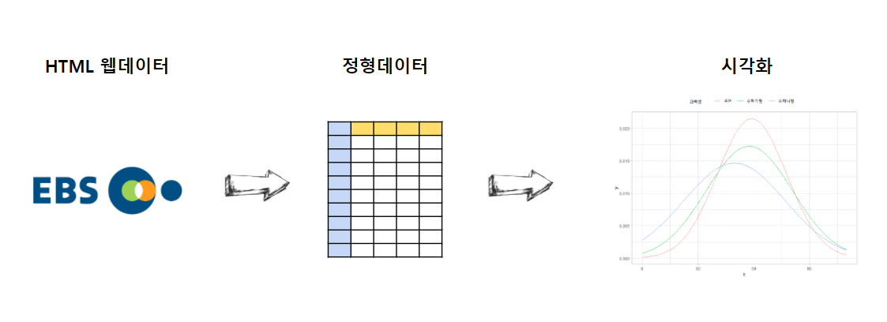

```{r setup2, include=FALSE}
knitr::opts_chunk$set(echo = TRUE, message=FALSE, warning=FALSE,
                      comment="", digits = 3, tidy = FALSE, prompt = FALSE, fig.align = 'center')

library(reticulate)
```



# 수능시험 [^ebs-exam] {#math-gre}

[^ebs-exam]: [EBS 수능시험 - 풀서비스](http://www.ebsi.co.kr/ebs/xip/xipa/retrieveSCVMainInfo.ebs?irecord=202012033)

학력고사로 대학을 입학한 세대가 다시 대학입학 관련 문제를 다시 보게 되는 경우는 아마도 자식이 대학을 갈 때가 될 때인지 싶다.
학력고사를 통해 나온 점수에 맞춰 대학에 진학을 했는데 20~30년이 지난 후에 수능문제는 얼마나 달라졌는지 데이터 과학 접근법을 취해 데이터로 살펴보자.

# 성적분포 데이터 {#assume-normal}

[EBS 풀서비스](http://www.ebsi.co.kr/ebs/xip/xipa/retrieveSCVMainInfo.ebs?irecord=202012033&targetCd=D300) 웹사이트에서 문제, 정답표, 해설지 뿐만 아니라 다양한 통계정보를 얻을 수 있다. 먼저 국영수에 대한 평균과 표준편차를 추출하여 정형데이터로 만들어보자.

수능시험 등급컷의 경우 "국수영한", "사회", "과학", ... 와 같이 해당 과목에 등급을 모두 보여줘야 되서 `POST` 방식으로 해당 인자를 넘겨줘야 수능등급 표를 얻을 수 있다. HTML 웹페이지에서 과목 평균, 표준편차를 얻어내고 등급표를 하나의 데이터프레임으로 담아 후속 분석을 위한 준비를 한다.

```{r assume-normal-score}
library(tidyverse)
library(rvest)
library(xml2)
library(httr)

# Base URL
base_url <- "http://www.ebsi.co.kr/ebs/xip/xipa/retrieveGrdCutList.ebs"

# 국영수 ----
국영수 <- "subjectId=60001,63004,80003,80003,63004,61007,60001,61001,61001,61007&irecord=202012033&ord=1"
# key_subject <- "subjectId=60001,63004,80003,80003,63004,61007,60001,61001,61001,61007&irecord=202012033&ord=1"
# 사회 ----
사회 <- "subjectId=141,142,140112,66002,66001,63003,63002,63001,146&irecord=202012033&ord=2"
# 과학 ----
과학 <- "subjectId=154,155,156,159,158,140116,140115,157&irecord=202012033&ord=3"

key_subject_url <- glue::glue("{base_url}?{`국영수`}")

Sys.setlocale("LC_ALL", "C")

key_subject_html <- key_subject_url %>% 
  read_html(encoding = 'EUC-KR')  

## 과목별 등급표 -----

subject_list <- list()

for(i in 1:5) {
  subject_list[[i]] <- key_subject_html %>% 
    html_node(xpath = glue::glue("/html/body/section[{i}]/table")) %>% 
    html_table(fill = TRUE)
}

Sys.setlocale("LC_ALL", "Korean")

subject_rank_tbl <- subject_list %>% 
  enframe(name = "순", "등급표")

## 과목 통계 -----

subject_rank_tbl

## 과목 통계 -----

key_subject_name_v <- key_subject_html %>% 
  html_nodes(css = 'h2') %>% 
  html_text() %>% 
  str_trim()

key_subject_stat_v <- key_subject_html %>% 
  html_nodes(css = 'p') %>% 
  html_text() %>% 
  str_remove_all("\n\t\t\t") %>% 
  str_remove_all("\n\t\t") %>% 
  str_trim()

key_subject_tbl <- tibble(과목명 = key_subject_name_v, 통계=key_subject_stat_v) %>% 
  separate(통계, into = c("평균", "표준편차"), sep = "표준편차") %>% 
  mutate(평균 = parse_number(평균),
         표준편차 = parse_number(표준편차))

key_subject_tbl

# 교과목 통계 + 등급표

key_tbl <- bind_cols(key_subject_tbl, subject_rank_tbl)

key_tbl
```


# 등급별 시각화 {#assume-normal-viz}

데이터의 통계 정보가 있어 정규분포를 가정하고 평균과 표준편차를 각 과목별 등급을 표시하여 시각화를 한다.

```{r visualize-cut}
key_viz_tbl <- key_tbl %>% 
  select(-순) %>% 
  mutate(dnorm_data = purrr::map2(평균, 표준편차, 
                           ~tibble(x = seq(0, 110, length.out = 100),
                                   y = dnorm(x, .x, .y)))) %>% 
  na.omit()

key_viz_tbl %>% 
  unnest(등급표) %>% 
  ggplot() +
    geom_vline(aes(xintercept = 원점수, color = 과목명)) +
    geom_line(data = key_viz_tbl %>% unnest(dnorm_data), aes(x, y, color = 과목명)) +
    facet_wrap(~과목명, ncol=1) +
    theme_light() +
    theme(legend.position = "none")  +
    labs(x="원점수", y="밀도",
         title = "2021년 수능 등급 분포")
```

평균과 표준편차 정보가 확인된 국어와 수학가형, 수학나형에 대한 성적분포를 비교해보자.


```{r key-subject-distribution-comparison}
key_viz_tbl %>% 
  unnest(dnorm_data) %>% 
  ggplot(aes(x, y, color = 과목명)) +
  geom_line() +
  scale_x_continuous(limits = c(0,110)) +
  theme_light() +
  theme(legend.position = "top") +
    labs(x="원점수", y="밀도",
         title = "2021년 수능 국어, 수학 성적분포 비교")  
```

