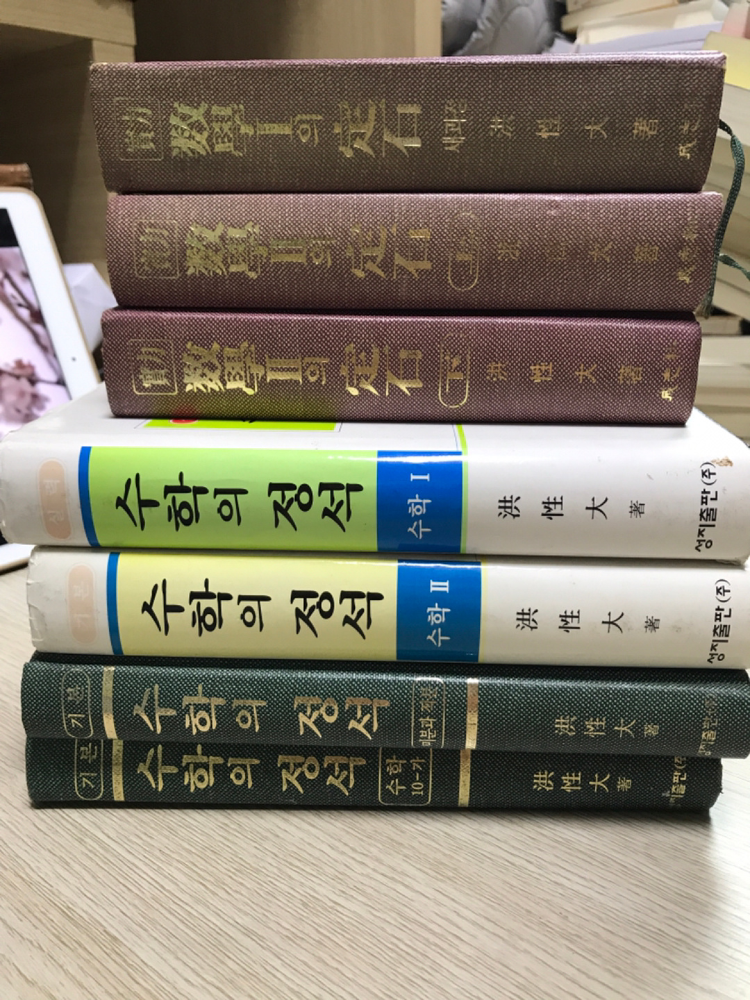

```{r setup2, include=FALSE}
knitr::opts_chunk$set(echo = TRUE, message=FALSE, warning=FALSE,
                      comment="", digits = 3, tidy = FALSE, prompt = FALSE, fig.align = 'center')

library(reticulate)
```

<center>



</center>

# 초등학교 수학 교육과정 {#elementary-math}

나무위키 [초등학교 수학](https://namu.wiki/w/%EC%B4%88%EB%93%B1%ED%95%99%EA%B5%90%20%EC%88%98%ED%95%99)에서 교육과정 데이터를 추출하여 시각화하면 많은 것을 배울 수 있다.

```{r elementary-school}
library(collapsibleTree)
library(tidyverse)

elementary_dat <- read_delim("data/elementary.txt", delim = "|")

elementary_curriculum <- elementary_dat %>% 
  separate(category, into = c("category_II", "category_I"), sep = "\\(") %>% 
  mutate(category_I = str_remove_all(category_I, pattern = "([0-9]{1,2}+)|(\\[)|(\\])|(\\))|(ㄱ-ㅎ)|([A-Z])"),
         category_I = str_remove(category_I, "ㄱ")) %>% 
  relocate(category_I, .after = class)

elementary_curriculum %>% 
  mutate_all(.funs = utf8::as_utf8) %>% 
  collapsibleTree(c("class", "category_I", "category_II"))
```


# 중학교 수학 교육과정 {#math-middle-school}

[2020년 중학교 수학 교육과정](https://m.blog.naver.com/holpi37/221758645852) 내용을 참고하여 2015년 개정 교육과정을 배우게 된다고 합니다.

```{r middle-school}
middle_school_tbl <- tribble(~"class", ~"category_I", ~"category_II",
                             "중1", "Ⅰ.수와 연산","1. 소인수분해",
                             "중1", "Ⅰ.수와 연산", "2. 정수와 유리수",
                             "중1", "Ⅱ.문자와 식", "1. 문자의 사용과 식의 계산",
                             "중1", "Ⅱ.문자와 식",  "2. 일차방정식",
                             "중1", "Ⅲ.좌표평면과 그래프", "1. 좌표평면과 그래프",
                             "중1", "Ⅳ.기본 도형", "1. 기본 도형",
                             "중1", "Ⅳ.기본 도형", "2. 작도와 합동",
                             "중1", "Ⅴ.평면도형과 입체도형", "1. 평면도형의 성질",
                             "중1", "Ⅴ.평면도형과 입체도형", "2. 입체도형의 성질",
                             "중1", "Ⅵ. 통계",  "1. 자료의 정리와 해석",
                             "중2", "Ⅰ.수와 식의 계산", "1. 유리수와 순환소수", 
                             "중2", "Ⅰ.수와 식의 계산", "2. 식의 계산",
                             "중2", "Ⅱ.일차부등식과 연립일차방정식", "1. 일차부등식과 연립일차방정식",
                             "중2", "Ⅲ.일차함수", "1. 일차함수와 그래프",
                             "중2", "Ⅲ.일차함수", "2. 일차함수와 일차방정식의 관계",
                             "중2", "Ⅳ.도형의 성질", "1.삼각형의 성질",
                             "중2", "Ⅳ.도형의 성질", "2.사각형의 성질",
                             "중2", "Ⅴ.도형의 닮음", "1. 도형의 닮음", 
                             "중2", "Ⅴ.도형의 닮음", "2. 닮은 도형의 성질",
                             "중2", "Ⅴ.도형의 닮음", "3. 피타고라스 정리", 
                             "중2", "Ⅵ.확률", "1. 경우의 수와 확률",
                             "중3", "Ⅰ.실수와 그 계산", "1. 제곱근과 실수",
                             "중3", "Ⅰ.실수와 그 계산", "2. 근호를 포함한 식의 계산",
                             "중3", "Ⅱ.식의 계산과 이차방정식", "1. 다항식의 곱셈과 인수분해",
                             "중3", "Ⅱ.식의 계산과 이차방정식", "2. 이차방정식",
                             "중3", "Ⅲ.이차함수", "1. 이차함수와 그 그래프",
                             "중3", "Ⅲ.이차함수", "2. 이차함수 y=ax2+bx+c의 그래프",
                             "중3", "Ⅳ.삼각비", "1. 삼각비",
                             "중3", "Ⅳ.삼각비", "2. 삼각비의 활용",
                             "중3", "Ⅴ.원의 성질", "1. 원과 직선", 
                             "중3", "Ⅴ.원의 성질", "2. 원주각",
                             "중3", "Ⅵ.통계", "1. 대푯값과 산포도",
                             "중3", "Ⅵ.통계", "2. 상관관계"
)

middle_school_tbl %>% 
  collapsibleTree(c("class", "category_I", "category_II"))
```


# 고등학교 수학 교육과정 {#high-school}

-   공통수학: '수학' 한 과목을 고등학교 1학년 동안 학습
    -   출판사: 편의상 1학기 범위를 수학(상), 2학기 범위를 수학(하)로 구분.
-   문과계열: 수학1, 수학2, 확률과 통계
    -   경상계열: 진로선택과목 중 경제수학
-   이과계열: 수학1, 확률과 통계, 미적분
    -   진로선택과목 중 기하, 수학과제탐구

| 진로     | 일반선택(수능출제)         | 진로선택(수능 미출제) |
|----------|----------------------------|-----------------------|
| 경상계열 | 수학1, 수학2, 확률과 통계  | 경제수학              |
| 어문계열 | 수학1, 수학2, 확률과 통계  |                       |
| 예술계열 | 수학1, 수학2, 확률과 통계  |                       |
| 이공계열 | 수학1, 미적분, 확률과 통계 | 기하, 수학과제탐구    |


[2020년 고등학교 수학 교육과정](https://m.blog.naver.com/holpi37/221758601070) 참고하여 공통수학 교육과정을 시각화한다.

```{r high-school-one}
hs_1_tbl <- tribble(~"class", ~"category_I", ~"category_II",
                    "공통수학", "Ⅰ. 다항식", "1. 다항식의 연산",
                    "공통수학", "Ⅰ. 다항식", "2. 항등식과 나머지정리",
                    "공통수학", "Ⅰ. 다항식", "3. 인수분해",
                    "공통수학", "Ⅱ. 방정식과 부등식", "1. 복소수와 이차방정식",
                    "공통수학", "Ⅱ. 방정식과 부등식", "2. 이차방정식과 이차함수",
                    "공통수학", "Ⅱ. 방정식과 부등식", "3. 여러가지 방정식과 부등식",
                    "공통수학", "Ⅲ. 도형의 방정식", "1. 평면좌표", 
                    "공통수학", "Ⅲ. 도형의 방정식", "2. 직선의 방정식", 
                    "공통수학", "Ⅲ. 도형의 방정식", "3. 원의 방정식", 
                    "공통수학", "Ⅲ. 도형의 방정식", "4. 도형의 이동", 
                    "공통수학", "Ⅳ. 집합과 명제", "1. 집합",
                    "공통수학", "Ⅳ. 집합과 명제", "2. 명제",
                    "공통수학", "Ⅴ. 함수와 그래프", "1. 함수",
                    "공통수학", "Ⅴ. 함수와 그래프", "2. 유리함수와 무리함수",
                    "공통수학", "Ⅵ. 경우의 수", "1. 경우의 수",
                    "공통수학", "Ⅵ. 경우의 수", "2. 순열과 조합")
hs_1_tbl %>% 
  collapsibleTree(c("class", "category_I", "category_II"))
```

## 문과 수학 교육과정 {#liberal-arts-math}

경상계열, 어문계열, 예술계열은 다음 수학과정을 모두 포함하는 것으로 갈음할 수 있다.


```{r liberal-art-math}

liberal_art_tbl <- tribble(~"class", ~"category_I", ~"category_II",
                           "수학Ⅰ", "Ⅰ. 지수함수와 로그함수", "1. 지수와 로그",
                           "수학Ⅰ", "Ⅰ. 지수함수와 로그함수", "2. 지수함수와 로그함수",
                           "수학Ⅰ", "Ⅱ. 삼각함수", "1. 삼각함수",
                           "수학Ⅰ", "Ⅱ. 삼각함수", "2. 사인법칙과 코사인법칙",
                           "수학Ⅰ", "Ⅲ. 수열", "1. 등차수열과 등비수열",
                           "수학Ⅰ", "Ⅲ. 수열", "2. 수열의 합",
                           "수학Ⅰ", "Ⅲ. 수열", "3. 수학적 귀납법",
                           "수학Ⅱ", "Ⅰ. 함수의 극한과 연속", "1. 함수의 극한",
                           "수학Ⅱ", "Ⅰ. 함수의 극한과 연속", "2. 함수의 연속",
                           "수학Ⅱ", "Ⅱ. 미분", "1. 미분계수와 도함수",
                           "수학Ⅱ", "Ⅱ. 미분", "2. 도함수의 활용",
                           "수학Ⅱ", "Ⅲ. 적분", "1. 부정적분과 정적분", 
                           "수학Ⅱ", "Ⅲ. 적분", "2. 정적분의 활용", 
                           "확률과 통계", "Ⅰ. 경우의 수", "1. 순열과 조합", 
                           "확률과 통계", "Ⅰ. 경우의 수", "2. 이항정리", 
                           "확률과 통계", "Ⅱ. 확률", "1. 확률의 뜻과 활용", 
                           "확률과 통계", "Ⅱ. 확률", "2. 조건부확률", 
                           "확률과 통계", "Ⅲ. 통계", "1. 확률분포", 
                           "확률과 통계", "Ⅲ. 통계", "2. 통계적 추정", 
                           "경제수학", "Ⅰ. 수와 생활경제", "1. 경제지표", 
                           "경제수학", "Ⅰ. 수와 생활경제", "2. 환율", 
                           "경제수학", "Ⅰ. 수와 생활경제", "3. 세금", 
                           "경제수학", "Ⅱ. 수열과 금융", "1. 이자와 원리합계", 
                           "경제수학", "Ⅱ. 수열과 금융", "2. 연속복리", 
                           "경제수학", "Ⅱ. 수열과 금융", "3. 연금", 
                           "경제수학", "Ⅲ. 함수와 경제", "1. 함수와 경제현상", 
                           "경제수학", "Ⅲ. 함수와 경제", "2. 함수의 활용", 
                           "경제수학", "Ⅳ. 미분과 경제", "1. 미분", 
                           "경제수학", "Ⅳ. 미분과 경제", "2. 미분과 경제문제", 
                           "실용수학", "Ⅰ. 규칙", "1. 식과 규칙", 
                           "실용수학", "Ⅰ. 규칙", "2. 도형과 규칙", 
                           "실용수학", "Ⅱ. 공간", "1. 도형의 관찰",
                           "실용수학", "Ⅱ. 공간", "2. 도형의 표현",
                           "실용수학", "Ⅲ. 자료", "1. 자료의 정리",
                           "실용수학", "Ⅲ. 자료", "2. 자료의 해석"
                           )

liberal_art_tbl %>% 
  collapsibleTree(c("class", "category_I", "category_II"))

```

## 이과 수학 교육과정 {#natural-science-math}

```{r natural-science-math}

natural_science_tbl <- tribble(~"class", ~"category_I", ~"category_II",
                           "미적분", "Ⅰ. 수열의 극한", "1. 수열의 극한", 
                           "미적분", "Ⅰ. 수열의 극한", "2. 급수", 
                           "미적분", "Ⅱ. 미분법", "1. 여러가지 함수의 미분", 
                           "미적분", "Ⅱ. 미분법", "2. 여러가지 미분법", 
                           "미적분", "Ⅱ. 미분법", "3. 도함수의 활용", 
                           "미적분", "Ⅲ. 적분법", "1. 여러가지 적분법", 
                           "미적분", "Ⅲ. 적분법", "2. 정적분의 활용",
                           "기하", "Ⅰ. 이차곡선", "1. 이차곡선",
                           "기하", "Ⅱ. 평면벡터", "1. 벡터의 연산",
                           "기하", "Ⅱ. 평면벡터", "2. 평면벡터의 성분과 내적",
                           "기하", "Ⅲ. 공간도형과 공간좌표", "1. 직선과 평면",
                           "기하", "Ⅲ. 공간도형과 공간좌표", "2. 정사영",
                           "기하", "Ⅲ. 공간도형과 공간좌표", "3. 공간좌표",
                           "수학과제탐구", "Ⅰ. 과학 탐구의 이해", "1. 수학과제 탐구의 의미와 필요성", 
                           "수학과제탐구", "Ⅰ. 과학 탐구의 이해", "2. 과제 탐구 방법과 절차", 
                           "수학과제탐구", "Ⅰ. 과학 탐구의 이해", "3. 연구 윤리", 
                           "수학과제탐구", "Ⅱ. 과학 탐구 실행 및 평가", "1. 탐구 주제 선정", 
                           "수학과제탐구", "Ⅱ. 과학 탐구 실행 및 평가", "2. 탐구 계획 수립", 
                           "수학과제탐구", "Ⅱ. 과학 탐구 실행 및 평가", "3. 탐구 수행", 
                           "수학과제탐구", "Ⅱ. 과학 탐구 실행 및 평가", "4. 탐구 결과 정리 및 발표", 
                           "수학과제탐구", "Ⅱ. 과학 탐구 실행 및 평가", "5. 반성 및 평가",
                           "심화수학1", "Ⅰ. 방정식과 부등식", "1. 방정식", 
                           "심화수학1", "Ⅰ. 방정식과 부등식", "2. 부등식", 
                           "심화수학1", "Ⅱ. 지수함수와 로그함수", "1. 지수함수", 
                           "심화수학1", "Ⅱ. 지수함수와 로그함수", "2. 로그함수", 
                           "심화수학1", "Ⅲ. 삼각함수", "1. 삼각함수", 
                           "심화수학1", "Ⅲ. 삼각함수", "2. 삼각함수의 활용", 
                           "심화수학1", "Ⅳ. 수열과 극한", "1. 수열", 
                           "심화수학1", "Ⅳ. 수열과 극한", "2. 수열의 극한", 
                           "심화수학1", "Ⅴ. 미분", "1. 함수의 극한과 연속", 
                           "심화수학1", "Ⅴ. 미분", "2. 미분계수와 도함수", 
                           "심화수학1", "Ⅴ. 미분", "3. 여러 가지 미분법", 
                           "심화수학1", "Ⅴ. 미분", "4. 도함수의 활용", 
                           "심화수학2", "Ⅰ. 적분", "1. 부정적분", 
                           "심화수학2", "Ⅰ. 적분", "2. 정적분", 
                           "심화수학2", "Ⅱ. 이차곡선", "1. 이차곡선",
                           "심화수학2", "Ⅲ. 공간도형과 공간좌표", "1. 공간도형", 
                           "심화수학2", "Ⅲ. 공간도형과 공간좌표", "2. 공간좌표", 
                           "심화수학2", "Ⅳ. 확률", "1. 순열과 조합", 
                           "심화수학2", "Ⅳ. 확률", "2. 확률의 뜻과 성질", 
                           "심화수학2", "Ⅳ. 확률", "3. 조건부확률", 
                           "심화수학2", "Ⅴ. 통계", "1. 확률 분포", 
                           "심화수학2", "Ⅴ. 통계", "2. 통계적 추정", 
                           "고급수학1", "Ⅰ. 벡터", "1. 벡터", 
                           "고급수학1", "Ⅰ. 벡터", "2. 도형의 방정식", 
                           "고급수학1", "Ⅱ. 행렬과 선형변환", "1. 행렬의 연산과 행렬식", 
                           "고급수학1", "Ⅱ. 행렬과 선형변환", "2. 역행렬과 연립일차방정식", 
                           "고급수학1", "Ⅱ. 행렬과 선형변환", "3. 행렬과 선형변환", 
                           "고급수학1", "Ⅱ. 행렬과 선형변환", "4. 행렬의 대각화", 
                           "고급수학1", "Ⅲ. 복소수와 극좌표", "1. 복소수와 극형식", 
                           "고급수학1", "Ⅲ. 복소수와 극좌표", "2. 극좌표와 극방정식", 
                           "고급수학1", "Ⅳ. 그래프", "1. 그래프와 행렬", 
                           "고급수학1", "Ⅳ. 그래프", "2. 평면그래프와 수형도",
                           "고급수학2", "Ⅰ. 미적분의 활용", "1. 미분의 활용", 
                           "고급수학2", "Ⅰ. 미적분의 활용", "2. 적분의 활용", 
                           "고급수학2", "Ⅱ. 급수", "1. 급수의 수렴과 발산", 
                           "고급수학2", "Ⅱ. 급수", "2. 멱급수", 
                           "고급수학2", "Ⅲ. 수학적 모델링", "1. 수학적 모델링", 
                           "고급수학2", "Ⅲ. 수학적 모델링", "2. 그래프와 모델링", 
                           "고급수학2", "Ⅲ. 수학적 모델링", "3. 행렬과 모델링", 
                           "고급수학2", "Ⅲ. 수학적 모델링", "4. 미분방정식과 모델링"                           
)

natural_science_tbl %>% 
  collapsibleTree(c("class", "category_I", "category_II"))
```
