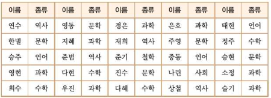

```{r setup2, include=FALSE}
knitr::opts_chunk$set(echo = TRUE, message=FALSE, warning=FALSE,
                      comment="", digits = 3, tidy = FALSE, prompt = FALSE, fig.align = 'center')

library(reticulate)
```

# 초등 수학 5-2 {#stat-elementary-5}

초등학교 5학년 2학기 "평균과 가능성" 단원이 등장하고 "수의 범위와 어림하기"도 최대값 최소값을 기초통계량으로 구하는데 필히 도움이 되는 내용이다.

## 이상과 이하를 알아볼까요? {#max-min}

준기네 반 학생들이 왕복 오래달리기를 하였습니다. 준기네 반 학생들의 기록을 알아봅시다.

| 이름     | 준기 | 명환 | 은서 | 나린 | 예은 | 상철 |
|----------|------|------|------|------|------|------|
| 횟수(회) | 70   | 65   | 75   | 73   | 68   | 71   |

-   왕복 오래달리기 횟수가 70회와 같거나 많은 학생의 기록을 모두 써 보세요.

    -   준기, 은서, 나린, 상철

-   70과 같거나 큰 수를 어떻게 말하면 좋을지 이야기해 보세요.

    -   70 이상인 수라고 합니다.

상기 문제를 R 코드로 작성하여 풀면 다음과 같다.

```{r solve-math-problem}
run_vector <- c(70, 65, 75, 73, 68, 71)

count_over_70 <- 0

for(i in 1:length(run_vector)) {
  if(run_vector[i] >= 70) {
    count_over_70 <- count_over_70 +1
  }
}

cat("왕복 오래달리기 기록 70 이상인 학생: ", count_over_70, "\n")
```

상기 오래달리기를 1차원 그래프로 시각화해보자.

```{r solve-math-problem-viz}
library(tidyverse)

name_vector <- c("준기", "명환", "은서", "나린", "예은", "상철")

run_tbl <- tibble(기록 = run_vector,
                  이름 = name_vector) %>% 
  mutate(indicator = ifelse(run_vector >=70, "이상", "미만"))

run_tbl %>% 
  ggplot(aes(x=기록, y=c(0), color = indicator)) +
    geom_point(size = 2) +
    geom_text(aes(label=`이름`), vjust = 2) +
    geom_segment(x=70, xend=70, y=-0.1, yend=0.1, size=0.5, linetype = "dashed") +
    scale_y_continuous(limits = c(-0.1, 0.1)) +
    theme(axis.line=element_blank(),
          axis.text.y=element_blank(),
          axis.ticks=element_blank(),
          axis.title.x=element_blank(),
          axis.title.y=element_blank(),
          panel.background=element_blank(),
          panel.border=element_blank(),
          panel.grid.major=element_blank(),
          panel.grid.minor=element_blank(),
          plot.background=element_blank(),
          plot.margin=unit(c(0,0,0,0), "cm"),
          panel.spacing=unit(c(0,0,0,0), "cm"),
          legend.position = "top") +
  labs(color = "오래달리기 기준 70") +
  scale_color_manual(values = c("blue", "red"))
```

## 평균 {#average}

준기네 반 볼링 핀 쓰러뜨리기 선수의 기록을 나타낸 표입니다. 이 선수가 쓰러뜨린 볼링핀 수의 평균을 구해 봅시다.

|  회 | 쓰러뜨린 볼링 핀의 수 |
|:---:|:---------------------:|
| 1회 |           9           |
| 2회 |           6           |
| 3회 |           10          |
| 4회 |           7           |

평균을 구하는 방식은 쓰러뜨린 볼링 핀의 수를 모두 더한 후에 시행횟수만큼 나눠주면 된다. 

$$\frac{9+6+10+7}{1+1+1+1} = \frac{32}{4} = 8$$

```{r average-pinball}
trial <- c("1회", "2회", "3회", "4회")
pins  <- c(9, 6, 10, 7)

bowling_tbl <- tibble(회 = trial, 
                      `핀의 수` = pins)

bowling_tbl %>% 
  summarise(평균  = mean(`핀의 수`),
            평균2 = sum(`핀의 수`) / n())
```

그래프로 시각화하면 다음과 같다.

```{r average-binball-viz}
library(ggimage)
library(magick)
library(cowplot)

bowling_img <- magick::image_read("fig/bowling-pins.png")

bowling_tbl %>% 
  mutate(image = "fig/bowling-pins.png") %>% 
  ggplot(aes(x=회, y= `핀의 수`, fill = 회)) +
    geom_col(width = 0.5) +
    geom_text(aes(label =`핀의 수`), vjust = -2, size = 5) +
    scale_y_continuous(limits = c(0,11)) +
    theme_light() +
    labs(title = "준기네 반 볼링핀 쓰러뜨리기 선수 기록",
         x = "", y="쓰러뜨린 핀의 수") +
    theme(legend.position = "none") +
    draw_image(bowling_img,  x = 3.9, y = 9, scale = 3)
```  

좀더 직관적으로 표현하기 위해 점그래프(dotplot)를 사용해서 시각화를 한다.

```{r make-dot-plot}
bowling_tbl %>% 
  tidyr::uncount(`핀의 수`) %>% 
  mutate(image = "fig/bowling-pins.png") %>%   
  ggplot(aes(x=회)) +
    geom_dotplot(method = 'histodot', binwidth = 1) +
    scale_y_continuous(NULL, breaks = NULL) +
    theme_light() +
    draw_image(bowling_img,  x = 3.9, y = 9, scale = 3) +
    labs(title = "준기네 반 볼링핀 쓰러뜨리기 선수 기록",
         x = "", y="쓰러뜨린 핀의 수") +
    coord_fixed(ratio = 10)
```


# 초등 수학 6-1 {#stat-elementary-6-1}

연수네 반 학생들은 학교 도서관에서 책을 한권씩 빌렸습니다. 반 학생들이 빌린 책을 조사하여 종류별로 정리했습니다.
조사한 내용을 표로 나타내어 보세요.




데이터가 Tidy한 데이터가 아니라서 깔끔하게 정리한다.


```{r math-5-2}
book_dat <- readxl::read_excel("data/math-5-2.xlsx", sheet="Sheet1")

book_tbl <- book_dat %>% select(1:2) %>% 
  set_names(c("이름", "종류")) %>% 
  bind_rows(
    book_dat %>% select(3:4) %>% 
    set_names(c("이름", "종류"))
  ) %>% 
  bind_rows(
    book_dat %>% select(5:6) %>% 
    set_names(c("이름", "종류"))
  ) %>% 
  bind_rows(
    book_dat %>% select(7:8) %>% 
    set_names(c("이름", "종류"))
  ) %>% 
  bind_rows(
    book_dat %>% select(9:10) %>% 
    set_names(c("이름", "종류"))
  )
  
book_tbl %>% 
  reactable::reactable()
```


학생들이 빌린 책을 종류별로 숫자를 세어보자.
각각 하나의 종류가 있는 책을 기타("사회", "철학")로 분류하여 책 종류를 줄여 빌린 책의 종류를 세어보자.


```{r math-5-2-table-long}
book_table <- book_tbl %>% 
  mutate(종류 = fct_lump(종류, n = 5, other_level = "기타")) %>% 
  count(종류, sort=TRUE, name = "권수(권)") %>% 
  add_row(종류 = "합계", `권수(권)` = 25)

book_table
```

나와 있는 것을 다음과 같이 횡으로 된 표를 작성해보자.

```{r math-5-2-table-wide}
book_table %>% 
  pivot_wider(names_from = 종류, values_from = `권수(권)`)
```

전체 빌린 책의 종류별 권수에 대해 백분율을 구해보자.
즉, 전체를 100%으로 놓았을 때 각 책의 종류별 비율을 계산하여 감을 잡는 것이다.

```{r math-percentage}
book_table %>% 
  filter(종류 != "합계") %>% 
  mutate("백분율(%)" = `권수(권)` / sum(`권수(권)`) * 100) %>% 
  add_row(종류 = "합계", `권수(권)` = 25, `백분율(%)` = 100)
```

전체에 대한 각 부분의 비율을 띠 모양에 나타낸 그래프를 **띠그래프**라고 한다.


```{r barplot-book}
book_table %>% 
  filter(종류 != "합계") %>% 
  mutate(종류 = factor(종류, levels = c("과학", "문학", "수학", "역사", "언어", "기타")) %>% 
             fct_rev(.)) %>% 
  ggplot(aes(x = "", y = `권수(권)`, fill = 종류)) +
    geom_col(position = "fill", width = 0.3) +
    coord_flip() +
    scale_y_continuous(labels = scales::percent) +
    scale_x_discrete(expand = expansion(add = .5)) +
    theme_minimal()+
    theme(legend.position = "top",
          plot.margin = unit(c(0,0,0,0),"mm"))  +
    guides(fill = guide_legend(nrow = 1,
                             reverse = TRUE))  +
    labs(x="") +
    scale_fill_brewer(palette = "Pastel1") +
    geom_text(aes(y = `권수(권)` / sum(`권수(권)`), label = paste0(종류, "\n", `권수(권)`)), position = position_stack(vjust = 0.5))

```

상기 그래프를 원그래프로 표현하면 다음가 같다.
즉, 원좌표계(`coord_polar`)로 변환시켜 띠그래프를 원그래프로 표현한다.

```{r pieplot-book}
blank_theme <- theme_minimal()+
  theme(
  axis.title.x = element_blank(),
  axis.title.y = element_blank(),
  panel.border = element_blank(),
  panel.grid=element_blank(),
  axis.ticks = element_blank(),
  plot.title=element_text(size=14, face="bold")
  )

book_table %>% 
  filter(종류 != "합계") %>% 
  mutate(종류 = factor(종류, levels = c("과학", "문학", "수학", "역사", "언어", "기타")) %>% 
             fct_rev(.)) %>% 
  ggplot(aes(x = "", y =`권수(권)`, fill = 종류)) +
    geom_col(stat = "identity", width = 0.3) +
    coord_polar("y", start = 0) +
    scale_y_continuous(labels = scales::percent) +
    scale_x_discrete(position = ) +
    blank_theme +
    theme(legend.position = "top",
          plot.margin = unit(c(0,0,0,0),"mm"),
          axis.text.x=element_blank())  +
    guides(fill = guide_legend(nrow = 1,
                             reverse = TRUE))  +
    scale_fill_brewer(palette = "Pastel1") +
    geom_text(aes(label = paste(종류, "\n", round(`권수(권)`/ sum(`권수(권)`) * 100, 1), "%")),
            position = position_stack(vjust = 0.5)) 
```

# 통계 활용 포스터 {#stat-poster}


- [전국학생통계활용대회 - 전국학생통계활용대회](http://www.xn--989a71jnrsfnkgufki.kr/report/main.do)
- [온라인 전시회 보러가기](https://nollaplace.com/kostat/)

```{r embed-pdf, out.height = "460px", out.width='800px'}
knitr::include_graphics("data/2020_05_poster.pdf")
```
