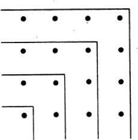

```{r setup2, include=FALSE}
knitr::opts_chunk$set(echo = TRUE, message=FALSE, warning=FALSE,
                      comment="", digits = 3, tidy = FALSE, prompt = FALSE, fig.align = 'center')

library(reticulate)
```

# 고대 그리스 수학 [^1] {#ancient-greece}

[^1]: [Dr. Tom McNamara, "History of Mathematics", Youtube](https://www.youtube.com/watch?v=RyuuYJ4iGKU&list=PLBevhpjdlMgnOIMqZwyNmQMi_5hzI3oQK)

고대 그리스 수학은 세가지 측면에서 큰 발전을 이뤘다. [@hollingdale2006makers]

-   **추상화(Abstraction)**: 수학의 추상화는 수학 개념의 기본 구조, 패턴 또는 속성을 추출하여 원래 연결된 실제 객체에 대한 의존성을 제거하고 더 넓게 적용하거나 다른 초록과 일치하도록 일반화하는 프로세스. 컴퓨터 과학에서는 복잡한 자료, 모듈, 시스템 등으로부터 핵심적인 개념 또는 기능을 간추려 내는 것.

-   **연역적 추론(Deductive Reasoning)**: 이미 알고 있는 판단을 근거로 새로운 판단을 유도하는 추론이다. 여기서 이미 알고 있는 판단은 전제, 새로운 판단은 결론이다. 진리가 될 수 있는 가능성을 따지는 귀납 추론과는 달리, 명제들 간의 관계와 논리적 타당성을 따진다.

    -   **귀납적 추론(Inductive Reasoning)**: 개별적인 특수한 사실이나 현상에서 그러한 사례들이 포함되는 일반적인 결론을 이끌어내는 추론 형식의 추리 방법이다.
    -   **수학적 귀납법 (Mathematical induction)**: 모든 자연수가 어떤 주어진 성질을 만족시킨다는 명제를 증명하는 방법의 하나이다. 가장 작은 자연수가 그 성질을 만족시킴을 증명한 뒤, 만약 어떤 자연수가 만족시키면 바로 다음 자연수 역시 만족시킴을 증명하기만 하면, 모든 자연수에 대한 증명이 끝난다.

-   **기하학(Geometry)**: 점, 선, 면 등 공간에 있는 공간에 있는 도형의 성질, 즉 대상들의 치수, 모양, 상대적 위치를 탐구하는 수학의 한 분야

# 수학적 귀납법 {#prove-by-mathematical-induction}

수학적 귀납법을 사용하여 자연수 홀수의 합이 $n^2$이 됨을 증명하자. 이를 수식으로 표현하면 다음과 같다.

$$1+3+...+(2n-1) = n^2,   n \in N$$ 상기 식을 증명하는데 수학적 귀납법을 사용한다.

## 1단계: 기본 사례 {#base-case .unnumbered}

기본 사례(base case)를 증명한다. 즉, 1인 경우 성립하는지 확인한다.

$$1 = 1^2$$

따라서, $1 = 1^2 = 1$이 성립한다.

## 2단계: 귀납 가정 {#second-case .unnumbered}

다음 단계로 귀납 가정(Inductive Hypothesis)을 상정한다. 즉, $k$에 대해 다음이 성립한다고 가정한다.

$$1+3+...+(2k-1) = k^2$$

## 3단계: 귀납 증명단계 {#third-case .unnumbered}

마지막으로 $k+1$을 생각해보자.

$$(1+3+\cdots +(2k-1))+(2(k+1)-1) = (1+3+\cdots +(2k-1))+(2k+1)$$ 상기 식을 정리하면 다음과 같다.

$$(1+3+\cdots +(2k-1))+(2k+1)=k^2+2k+1=(k+1)^2$$ 따라서, 수학적 귀납법에 따라 모든 $n\in \mathbb{N}$ 자연수에 대해 $1+3+\cdots+(2n-1)=n^2$ 이 성립함을 증명했다.

# 기하학 증명 {#prove-by-math}

홀수의 합이 $\text{홀수}^2$이 되는 것은 다음과 같이 기하학적으로 확인할 수 있다.

{width="303"}

# 재귀 함수 {#function-recurssion}

재귀 함수(recursion)를 사용해서 다음과 같이 앞선 수학적 귀납법을 프로그래밍 코드로 작성할 수 있다.

```{r mathematical-induction}

sum_of_odds_up_to_n <- function(n) {
  
  # 기본 사례
  if(n == 1) return(1)
  
  # 수학적 귀납법
  if(n != 1) return(sum_of_odds_up_to_n(n-1) + 2 * n - 1)

}

sum_of_odds_up_to_n(1)
sum_of_odds_up_to_n(3)
sum_of_odds_up_to_n(9)
```
