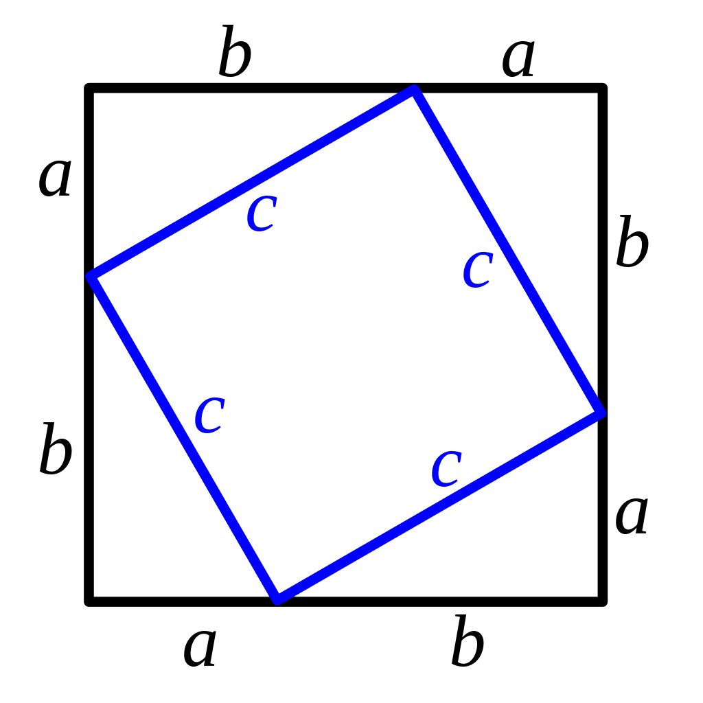
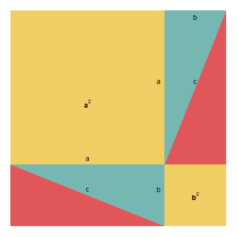

```{r setup2, include=FALSE}
knitr::opts_chunk$set(echo = TRUE, message=FALSE, warning=FALSE,
                      comment="", digits = 3, tidy = FALSE, prompt = FALSE, fig.align = 'center')

library(reticulate)
```

# 고대 그리스 수학 [^1] {#ancient-greece}

[^1]: [Dr. Tom McNamara, "History of Mathematics", Youtube](https://www.youtube.com/watch?v=RyuuYJ4iGKU&list=PLBevhpjdlMgnOIMqZwyNmQMi_5hzI3oQK)

고대 그리스 수학은 세가지 측면에서 큰 발전을 이뤘다. [@hollingdale2006makers]

-   **추상화(Abstraction)**: 수학의 추상화는 수학 개념의 기본 구조, 패턴 또는 속성을 추출하여 원래 연결된 실제 객체에 대한 의존성을 제거하고 더 넓게 적용하거나 다른 초록과 일치하도록 일반화하는 프로세스. 컴퓨터 과학에서는 복잡한 자료, 모듈, 시스템 등으로부터 핵심적인 개념 또는 기능을 간추려 내는 것.

-   **연역적 추론(Deductive Reasoning)**: 이미 알고 있는 판단을 근거로 새로운 판단을 유도하는 추론이다. 여기서 이미 알고 있는 판단은 전제, 새로운 판단은 결론이다. 진리가 될 수 있는 가능성을 따지는 귀납 추론과는 달리, 명제들 간의 관계와 논리적 타당성을 따진다.

    -   **귀납적 추론(Inductive Reasoning)**: 개별적인 특수한 사실이나 현상에서 그러한 사례들이 포함되는 일반적인 결론을 이끌어내는 추론 형식의 추리 방법이다.
    -   **수학적 귀납법 (Mathematical induction)**: 모든 자연수가 어떤 주어진 성질을 만족시킨다는 명제를 증명하는 방법의 하나이다. 가장 작은 자연수가 그 성질을 만족시킴을 증명한 뒤, 만약 어떤 자연수가 만족시키면 바로 다음 자연수 역시 만족시킴을 증명하기만 하면, 모든 자연수에 대한 증명이 끝난다.

-   **기하학(Geometry)**: 점, 선, 면 등 공간에 있는 공간에 있는 도형의 성질, 즉 대상들의 치수, 모양, 상대적 위치를 탐구하는 수학의 한 분야

## 수학적 귀납법 {#prove-by-mathematical-induction}

수학적 귀납법을 사용하여 자연수 홀수의 합이 $n^2$이 됨을 증명하자. 이를 수식으로 표현하면 다음과 같다.

$$1+3+...+(2n-1) = n^2,   n \in N$$ 상기 식을 증명하는데 수학적 귀납법을 사용한다.

## 1단계: 기본 사례 {#base-case .unnumbered}

기본 사례(base case)를 증명한다. 즉, 1인 경우 성립하는지 확인한다.

$$1 = 1^2$$

따라서, $1 = 1^2 = 1$이 성립한다.

## 2단계: 귀납 가정 {#second-case .unnumbered}

다음 단계로 귀납 가정(Inductive Hypothesis)을 상정한다. 즉, $k$에 대해 다음이 성립한다고 가정한다.

$$1+3+...+(2k-1) = k^2$$

## 3단계: 귀납 증명단계 {#third-case .unnumbered}

마지막으로 $k+1$을 생각해보자.

$$(1+3+\cdots +(2k-1))+(2(k+1)-1) = (1+3+\cdots +(2k-1))+(2k+1)$$ 상기 식을 정리하면 다음과 같다.

$$(1+3+\cdots +(2k-1))+(2k+1)=k^2+2k+1=(k+1)^2$$ 따라서, 수학적 귀납법에 따라 모든 $n\in \mathbb{N}$ 자연수에 대해 $1+3+\cdots+(2n-1)=n^2$ 이 성립함을 증명했다.

## 기하학 증명 {#prove-by-math}

홀수의 합이 $\text{홀수}^2$이 되는 것은 다음과 같이 기하학적으로 확인할 수 있다.

{width="303"}

## 재귀 함수 {#function-recurssion}

재귀 함수(recursion)를 사용해서 다음과 같이 앞선 수학적 귀납법을 프로그래밍 코드로 작성할 수 있다.

```{r mathematical-induction}

sum_of_odds_up_to_n <- function(n) {
  
  # 기본 사례
  if(n == 1) return(1)
  
  # 수학적 귀납법
  if(n != 1) return(sum_of_odds_up_to_n(n-1) + 2 * n - 1)

}

sum_of_odds_up_to_n(1)
sum_of_odds_up_to_n(3)
sum_of_odds_up_to_n(9)
```

# 피타고라스 정리 {#pythagoras-theorem}

**피타고라스 정리(Pythagoras Theorem)**는 직각 삼각형의 두 직각변 $a,b$를 각각 한 변으로 하는 정사각형 면적의 합은 빗변 $c$를 한 변으로 하는 정사각형의 면적과 같다는 정리다. 수식으로 표현하면 다음과 같다.

$$a^2 + b^2 = c^2$$

[피타고라스 정리 증명](https://ko.wikipedia.org/wiki/%ED%94%BC%ED%83%80%EA%B3%A0%EB%9D%BC%EC%8A%A4_%EC%A0%95%EB%A6%AC)은 수도 없이 많지만 위키에 나와 있는 유클리드 증명, 대수적 증명, 삼각형의 닮음을 통한 증명, 미국 대통령 가필드 증명 등이 있다. 여기서 대수적 증명을 살펴보자.

{width="268"}

먼저 큰 정사각형을 생각해보자. 큰 정사각형 전체 면적은 다음과 같다.

$$(a+b) \times (a+b) = (a+b)^2$$
다음으로 4개의 작은 삼각형의 합과 내부 정사각형의 면적을 구해보자.

$$c^2 + 4\times \frac{1}{2} a b = c^2 + 2 a b$$
동일한 면적을 한번은 전체를 한번에 구하고, 두번째는 삼각형 4개와 정사각형 하나로 쪼개 구했기 때문에 두 면적은 같다.
이를 정리하면 피다고라스 정리를 구할 수 있다.

$$c^2 + 2 a b = (a+b)^2$$
상기 수식을 $c^2$에 대해 풀면 다음과 같다. 

$$c^2 = (a+b)^2 - 2ab = a^2 + 2ab + b^2 - 2ab = a^2+b^2$$

## `GeoGebra` {#geogebra-pythagoras}

[Pythagorean Theorem Proof #4](https://www.geogebra.org/m/uW9Rcmmj)를 참고한다.

## `ggplot` {#ggplot-pythagoras}

`ggplot`을 통해 피타고라스 정리를 애니메이션으로 구현도 가능하다. 자세한 사항은 [`notesofdabbler/learn_gganimate`](https://github.com/notesofdabbler/learn_gganimate) 웹사이트를 참고한다.



```{r pythagoras, eval = FALSE}
library(ggplot2)
library(gganimate)
library(ggthemes)
library(dplyr)
library(transformr)

df1 = tibble(x = c(0, 7, 7, 0), y = c(0, 0, 7, 7), type = "sq", 
             xt = c(2.5, 6, NA, NA), yt = c(4, 1, NA, NA), lbl = c("bold(a^2)", "bold(b^2)",NA, NA))
df2 = tibble(x = c(0, 0, 5), y = c(0, 2, 0), type = "tr1")
df3 = tibble(x = c(0, 5, 5), y = c(2, 2, 0), type = "tr2",
             xt = c(2.5, 2.5, 4.8), yt = c(1.2, 2.2, 1.2), lbl = c("c", "a", "b"))
df4 = tibble(x = c(5, 7, 7), y = c(2, 2, 7), type = "tr3")
df5 = tibble(x = c(5, 5, 7), y = c(2, 7, 7), type = "tr4",
             xt = c(4.8, 6, 6), yt = c(4.7, 6.8, 4.7), lbl = c("a", "b", "c"))

df_a1 = bind_rows(df1, df2, df3, df4, df5) %>% mutate(state = "a1")

col_list = c("#F1CE63", "#E15759", "#76B7B2", "#E15759", "#76B7B2")
p = ggplot(df_a1) + geom_polygon(aes(x = x, y = y, group = type, fill = type))
p = p + geom_text(aes(x = xt, y = yt, label = lbl), parse = TRUE, size = 5)
p = p + scale_fill_manual(values = col_list) + guides(fill = FALSE)
p = p + theme_void()
p

#' The dataframe for the second state
#' and the associated plot is shown below
#'
#+ 
# State - a2
df1_a = tibble(x = c(0, 7, 7, 0), y = c(0, 0, 7, 7), type = "sq")
df5_a = tibble(x = c(0, 0, 2), y = c(2, 7, 7), type = "tr4",
               xt = c(0.2, 1, 1), yt = c(4.7, 6.8, 4.7), lbl = c("a", "b", "c"))
df_a2 = bind_rows(df1_a, df2, df3, df4, df5_a) %>% mutate(state = "a2")


p = ggplot(df_a2) + geom_polygon(aes(x = x, y = y, group = type, fill = type))
p = p + geom_text(aes(x = xt, y = yt, label = lbl), parse = TRUE, size = 5)
p = p + scale_fill_manual(values = col_list) + guides(fill = FALSE)
p = p + theme_void()
p

#' The dataframe for the third state
#' and the associated plot is shown below
#'
#+
# state - a3
df4_a = tibble(x = c(5, 7, 7), y = c(0, 0, 5), type = "tr3")
df_a3 = bind_rows(df1_a, df2, df3, df4_a, df5_a) %>% mutate(state = "a3")

p = ggplot(df_a3) + geom_polygon(aes(x = x, y = y, group = type, fill = type))
p = p + geom_text(aes(x = xt, y = yt, label = lbl), parse = TRUE, size = 5)
p = p + scale_fill_manual(values = col_list) + guides(fill = FALSE)
p = p + theme_void()
p

#' The dataframe for the fourth state
#' and the associated plot is shown below
#'
#+ 
# state - a4
df1_b = tibble(x = c(0, 7, 7, 0), y = c(0, 0, 7, 7), type = "sq", 
               xt = c(3.5, NA, NA, NA), yt = c(4, NA, NA, NA), lbl = c("bold(c^2)", NA ,NA, NA))
df3_a = tibble(x = c(2, 7, 7), y = c(7, 7, 5), type = "tr2",
               xt = c(4.5, 4.5, 6.8), yt = c(6.2, 6.8, 6.2), lbl = c("c", "a", "b"))
df_a4 = bind_rows(df1_b, df2, df3_a, df4_a, df5_a) %>% mutate(state = "a4")

p = ggplot(df_a4) + geom_polygon(aes(x = x, y = y, group = type, fill = type))
p = p + geom_text(aes(x = xt, y = yt, label = lbl), parse = TRUE, size = 5)
p = p + scale_fill_manual(values = col_list) + guides(fill = FALSE)
p = p + theme_void()
p

#' Now the dataframes for the 4 states are combined into a single dataframe
#' and gganimate is used to transition between states to construct the animation

#+ 
# combining the dataframe into a single dataframe for animation
df = bind_rows(df_a1, df_a2, df_a3, df_a4)

p = ggplot(df) + geom_polygon(aes(x = x, y = y, group = type, fill = type))
p = p + geom_text(aes(x = xt, y = yt, label = lbl), parse = TRUE, size = 5)
p = p + scale_fill_manual(values = col_list) + guides(fill = FALSE)
p = p + theme_void()

anim = p + transition_states(state, transition_length = 1, state_length = 2, wrap = FALSE)
animate(anim, renderer = gifski_renderer("figures/pythagoras_theorem.gif"))
```

# 반증법: $\sqrt{2}$ 무리수 {#greek-irrational-number}

**반증법(proof by contradition)** 혹은 귀류법은 간접증명법으로 어떤 주장에 대해 그 함의하는 내용을 따라가다보면 이치에 닿지 않는 내용 또는 결론에 이르게 된다는 것을 보여서 그 주장이 잘못된 것임을 보이는 것이다.

$x^2 = 2$, 즉 $x = \sqrt{2}$가 유리수가 아닌 무리수임을 증명하자.

1. $x$ 가 유리수라고 가정한다. 즉, $x = \frac{p}{q}$ 로 둔다. 여기서 $p, q$는 서로 서로소인 자연수라서 최대공약수가 1 이다. 이를 $gcd(p,q) = 1$이라고 한다.
1. 유리수로 가정했기 때문에 $\sqrt{2} = \frac{p}{q}$ 이 성립하고 양변을 제곱하면 $2 = \frac{p^2}{q^2}$ 이 된다. 따라서, $2q^2  = p^2$이 되어 $p$는 2의 배수 짝수가 된다.
1. $p$가 2의 배수 짝수이기 때문에 $p = 2k$와 같이 표현할 수 있다. 이를 통해 $(2k)^2 = 2q^2$이 되고 이를 $q$에 대해 정리하면 $q^2 = 2 k^2$이 된다. 즉, $q$도 2의 배수 짝수가 된다.
1. 하지만, $p, g$는 서로소이기 때문에 서로 공약수를 갖고 있지 않다고 했지만, $p, g$는 최소 2를 공약수로 갖는 관계가 성립되어 모순이 발생되어 $x^2 = 2$, 즉 $x = \sqrt{2}$는 유리수가 되지 못한다.


